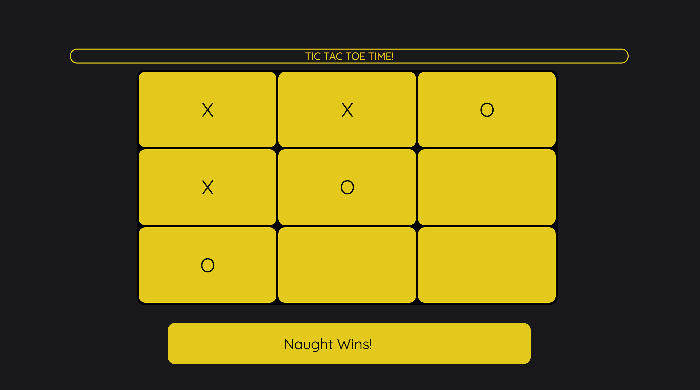

# Tic Tac Toe

This project represents my first attempt at creating a website from start to finish, which uses html, css, javascript and JQuery.

My live, [Tic Tac Toe](https://aparkinbotswana.github.io/tic_tac_toe/Index_tictactoe.html) site can be found here.

## Features

The main goal of this project was to program a computer opponent which would be able to detect if the player has two tokens placed in a row, and play to block the win.
